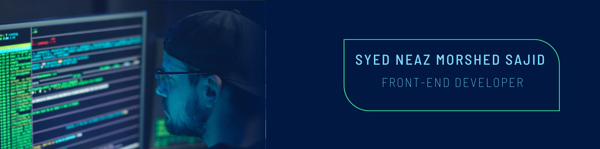

  
  ### Hi there 👋, My name is Syed Neaz Morshed Sajid

I'm a passionate frontend developer who loves building projects, learning new technologies, and collaborating with others.

---

  
### 🛠️ Technologies & Tools

#### **Frontend Development**

  
  
    
   
  
    
        
     

  
#### **Programming Languages**

  
  
  

  

---

  
### 📈 GitHub Stats

---

  
### 📞 Connect with Me

  
  
  
  

<picture>
  <source media="(prefers-color-scheme: dark)" srcset="https://raw.githubusercontent.com/morshedsajid26/morshedsajid26/output/github-snake-dark.svg" />
  <source media="(prefers-color-scheme: light)" srcset="https://raw.githubusercontent.com/morshedsajid26/morshedsajid26/output/github-snake.svg" />
  
</picture>

